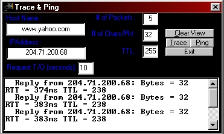



## Trace & Ping

### Description

----

READ BELOW FOR INFO AND QUESTION ANSWERS

----

----

Check out my other submissions!!!

----

----

I DID NOT WRITE THIS. I FRESHED UP THE CODE***

I have, on many occasions, found the need to be able to perform

a Ping function from within Visual Basic. There are a few OCX

Controls available on the market, however, they all require the

ability for the WinSock stack to support SOCK_RAW.

Microsoft does not support Raw Sockets on any of their WinSock1.1

stacks. It also appears that it will not be supported on the

Winsock2.0 stack for Windows95.

Raw Sockets, however, is supported on NT4.0.

Microsoft, due to the lack of support of Raw Sockets, created the

ICMP.DLL in order to perform basic ICMP functions such as PING and

TRACERT.

Well, I have finally figured out how to use the ICMP.DLL from Visual

Basic. There are not additives and no preservatives.

This program is provided as is, without any warranties. I am providing

it freely. I designed it on Windows95, however, I am sure it will work

on NT3.51. if you use portions of this code, please include some sort

of reference to the author.

This program was created by Jim Huff of Edinborg Productions.

If you have any questions, you can reach me at:

jimhuff@shentel.net

edinborg@shentel.net

----

 
### More Info
 

             |
---                |---
**Submitted On**   |2000-06-20 20:09:12
**By**             |[mp3guide](https://github.com/Planet-Source-Code/PSCIndex/blob/master/ByAuthor/mp3guide.md)
**Level**          |Intermediate
**User Rating**    |4.2 (21 globes from 5 users)
**Compatibility**  |VB 4\.0 \(32\-bit\), VB 5\.0, VB 6\.0
**Category**       |[Internet/ HTML](https://github.com/Planet-Source-Code/PSCIndex/blob/master/ByCategory/internet-html__1-34.md)
**World**          |[Visual Basic](https://github.com/Planet-Source-Code/PSCIndex/blob/master/ByWorld/visual-basic.md)
**Archive File**   |[CODE\_UPLOAD69446202000\.zip](https://github.com/Planet-Source-Code/mp3guide-trace-ping__1-9090/archive/master.zip)

